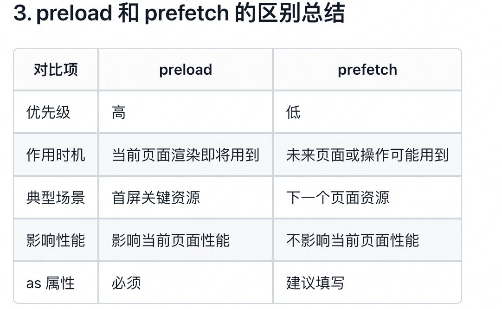

前端性能优化常见手段：

资源加载：代码压缩与合并、代码分割（按需加载）、使用 CDN、图片懒加载与压缩、合理设置缓存、减少 HTTP 请求数。
代码执行：减少重复计算、使用防抖/节流、将耗时任务交给 Web Worker、优化循环与递归、避免内存泄漏。
页面渲染：减少和合并 DOM 操作、使用虚拟 DOM、避免频繁重排重绘、批量更新数据、开启硬件加速

webp图片的优势：更高的压缩率、更好的兼容性、更好的图片质量、更好的动画支持、更好的画质

`<link>` 元素的 rel 属性的 preload 值和 prefetch 值可以用于预加载资源。

防抖与节流：
防抖（debounce）是指多次高频事件只在最后一次触发后执行一次，常用于搜索框输入、按钮防重复提交等场景。
节流（throttle）是指高频事件在固定时间间隔内只执行一次，常用于页面滚动、搜索联想等场景。

function debounce(fn, delay = 500) {
    // timer 是在闭包中的
    let timer = null;
    
    return function() {
        if (timer) {
            clearTimeout(timer)
        }
        timer = setTimeout(() => {
            fn.apply(this, arguments)
            timer = null
        }, delay)
    }
}

function throttle(fn, delay = 500) {
    let timer = null;
    
    return function() {
        if (timer) {
            return
        }
        timer = setTimeout(() => {
            fn.apply(this, arguments)
            timer = null
        }, delay)
    }
}

