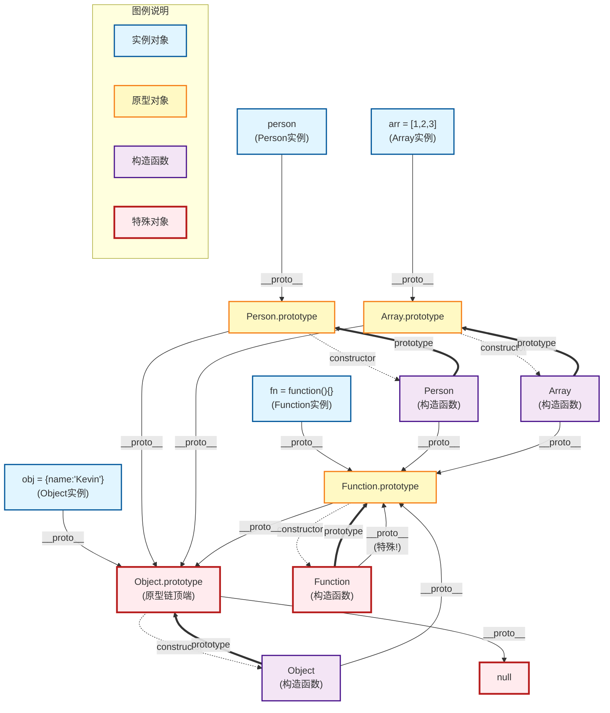

# 原型与原型链

## 一、构造函数创建对象

使用构造函数和`new`关键字创建实例对象。

```javascript
function Person() {}
var person = new Person();
person.name = 'Kevin';
console.log(person.name); // Kevin
```

在这个例子中，`Person`是一个构造函数，使用`new`创建了一个实例对象`person`。

## 二、prototype属性

每个函数都有一个`prototype`属性，这个属性指向一个对象，这个对象是调用该构造函数创建的实例的原型。

```javascript
function Person() {}
Person.prototype.name = 'Kevin';
var person1 = new Person();
var person2 = new Person();
console.log(person1.name); // Kevin
console.log(person2.name); // Kevin
```

`Person.prototype`是`person1`和`person2`的原型。你可以理解为，每一个JavaScript对象（null除外）在创建时都会关联另一个对象，这个对象就是原型，每个对象都会从原型"继承"属性。

## 三、__proto__属性

每一个JavaScript对象（除了null）都具有一个`__proto__`属性，这个属性指向该对象的原型。

```javascript
function Person() {}
var person = new Person();
console.log(person.__proto__ === Person.prototype); // true
```

`person.__proto__`指向`Person.prototype`，即实例对象的原型。

## 四、constructor属性

每个原型都有一个`constructor`属性，指向关联的构造函数。

```javascript
function Person() {}
console.log(Person === Person.prototype.constructor); // true
```

`Person.prototype.constructor`指向`Person`。

## 五、实例与原型

读取实例的属性时，如果找不到，会查找与对象关联的原型中的属性，如果还查不到，就去找原型的原型，一直找到最顶层为止。

```javascript
function Person() {}
Person.prototype.name = 'Kevin';
var person = new Person();
person.name = 'Daisy';
console.log(person.name); // Daisy

delete person.name;
console.log(person.name); // Kevin
```

在这个例子中，删除`person`的`name`属性后，会查找`Person.prototype`中的`name`属性，结果为`Kevin`。

## 六、原型的原型

原型对象也是通过`Object`构造函数生成的，`Object.prototype`的原型是`null`，表示原型链的终点。

```javascript
var obj = new Object();
obj.name = 'Kevin';
console.log(obj.name); // Kevin
```

`obj.__proto__`指向`Object.prototype`。

## 七、原型链

原型链是由相互关联的原型组成的链状结构，查找属性时沿着这条链进行查找，直到`Object.prototype`为止。

`Object.prototype.__proto__`的值是`null`，表示没有对象，即该处不应该有值。

```javascript
console.log(Object.prototype.__proto__ === null); // true
```

查找属性时，查到`Object.prototype`就可以停止查找了。

## 八、补充内容

### 8.1 constructor属性

实例对象没有`constructor`属性，但可以通过原型链访问到构造函数的`constructor`属性。

```javascript
function Person() {}
var person = new Person();
console.log(person.constructor === Person.prototype.constructor); // true
```

### 8.2 __proto__属性

- `__proto__`属性并不是标准属性，但在大多数浏览器中可用。
- 它实际上来自于`Object.prototype`，可以理解为返回`Object.getPrototypeOf(obj)`。

```javascript
console.log(Object.getPrototypeOf(person) === Person.prototype); // true
```

### 8.3 继承与委托

- JavaScript中的"继承"实际上是通过委托实现的，而不是复制属性。
- 这意味着JavaScript只是在两个对象之间创建一个关联，一个对象可以通过委托访问另一个对象的属性和函数。
- 例如，`person`对象可以通过`__proto__`访问`Person.prototype`中的属性和方法。

## 九、关系图示

### 9.1 综合原型链关系图（Mermaid）



**图示说明：**
- 🔵 **蓝色框**：实例对象
- 🟡 **黄色框**：原型对象
- 🟣 **紫色框**：构造函数
- 🔴 **红色框**：特殊对象（Object.prototype、Function、null）
- **实线箭头** `→`：`__proto__` 关系
- **虚线箭头** `⋯→`：`constructor` 关系
- **粗箭头** `⇒`：`prototype` 关系

### 9.2 原型链规律总结

**核心规则：**

1. **实例对象的原型链**：
   ```
   实例.__proto__ → 构造函数.prototype → Object.prototype → null
   ```

2. **构造函数的原型链**（所有构造函数都是 Function 的实例）：
   ```
   构造函数.__proto__ → Function.prototype → Object.prototype → null
   ```

3. **特殊情况**：
   - `Function.__proto__ === Function.prototype`（Function 是自己的实例）
   - `Object.prototype.__proto__ === null`（原型链的终点）

4. **万物皆对象**：
   - 所有函数（包括构造函数）都是 `Function` 的实例
   - 所有对象的原型链最终都会指向 `Object.prototype`
   - `Object.prototype` 是原型链的顶端，它的 `__proto__` 是 `null`

5. **三种关系**：
   - `__proto__`：实例与原型的连接（隐式原型）
   - `prototype`：构造函数与原型对象的连接（显式原型）
   - `constructor`：原型对象与构造函数的反向连接

## 十、总结

- **原型**：每个函数都有一个`prototype`属性，指向一个对象，这个对象是调用该构造函数创建的实例的原型。
- **原型链**：由相互关联的原型组成的链状结构，查找属性时沿着这条链进行查找，直到`Object.prototype`为止。
- **继承**：JavaScript中的继承实际上是通过委托实现的，而不是复制属性。