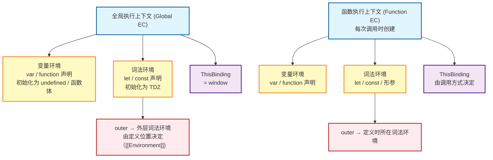

# 执行上下文

> 学习日期：2026-04-22

## 一、什么是执行上下文

执行上下文（Execution Context）是 JS 引擎执行一段代码时所需的**完整运行环境**，包含了代码执行所需的所有信息：变量、函数声明、this 指向、外部作用域引用等。

它随着 ECMAScript 版本演进，内部结构也在变化：

| 版本 | 组成 |
|------|------|
| ES3 | scope（作用域链）、variable object（变量对象 VO）、this |
| ES5 | LexicalEnvironment（词法环境）、VariableEnvironment（变量环境）、this |
| ES2018+ | LexicalEnvironment（含 this）、VariableEnvironment、code evaluation state、Function、ScriptOrModule、Realm、Generator |

面试场景以 **ES5 模型**为主流。

---

## 二、执行上下文的三种类型与创建时机

**全局执行上下文（Global EC）**

脚本首次加载时由 JS 引擎自动创建，整个程序生命周期内只有一个。浏览器中全局对象是 `window`，Node.js 中是 `global`。它始终位于调用栈底部，直到页面关闭才销毁。

**函数执行上下文（Function EC）**

每次**调用函数时**创建，不是定义时。同一个函数被调用多次，就会创建多个独立的执行上下文。函数执行完毕后，对应的上下文从调用栈弹出并销毁（闭包场景除外）。

**eval 执行上下文**

`eval()` 执行时创建，实际开发中几乎不用。

---

## 三、执行上下文的内部结构

用伪代码表示一个执行上下文的结构：

```js
ExecutionContext = {
  ThisBinding: <this 的值>,
  LexicalEnvironment: {
    EnvironmentRecord: { /* let/const/class/函数形参 */ },
    outer: <外部词法环境的引用>
  },
  VariableEnvironment: {
    EnvironmentRecord: { /* var/function 声明 */ },
    outer: <外部词法环境的引用>
  }
}
```

### 3.1 变量环境（VariableEnvironment）

专门存储 `var` 声明和函数声明（`function foo(){}`）。作用域是**函数级**，不受 `{}` 限制。

### 3.2 词法环境（LexicalEnvironment）

存储 `let`、`const`、`class` 声明以及函数形参。通过嵌套链式结构支持**块级作用域**，每进入一个 `{}` 块就新建一层词法环境并压栈，块结束后弹出。

两者都由**环境记录（Environment Record）**和**外部引用（outer）**组成。

### 3.3 变量环境与词法环境的区别

| 对比项 | 变量环境 | 词法环境 |
|--------|----------|----------|
| 存储内容 | `var`、函数声明 | `let`、`const`、`class`、形参 |
| 作用域粒度 | 函数级 | 块级（支持 `{}`） |
| 创建阶段初始值 | `undefined` | 未初始化（TDZ） |
| 块进入时 | 不新建 | 新建一层并压栈 |

---

## 四、执行上下文的两个阶段

每个执行上下文的生命周期分为**创建阶段**和**执行阶段**。

> ⚠️ 常见误区：执行上下文是在函数**被调用后、函数体第一行代码执行前**创建的。"调用时创建"和"执行前扫描"是同一件事的两个子步骤，并不矛盾。完整时序如下：
>
> ```
> 调用 foo()
>   → 立即创建 foo 的执行上下文（创建阶段：扫描、提升、TDZ）
>   → 压入调用栈
>   → 执行阶段：逐行运行 foo 的代码
>   → foo 执行完毕，弹出调用栈
> ```

### 4.1 创建阶段（编译阶段）

代码还没有开始逐行执行，JS 引擎先扫描整段代码，完成以下工作：

**① 确定 this 绑定**

在上下文创建时就确定，不会在执行阶段改变（具体规则见第六节）。

**② 处理 `var` 声明 → 进入变量环境，初始化为 `undefined`**

所有 `var` 变量在创建阶段就被登记到变量环境的环境记录中，并立即赋值为 `undefined`。这就是"变量提升"的本质——不是代码真的被移动了，而是在创建阶段就完成了登记和初始化。

**③ 处理函数声明 → 进入变量环境，完整提升（包括函数体）**

`function foo() {}` 这种函数声明，在创建阶段会被完整地存入变量环境，包括函数体本身。所以函数声明可以在定义之前调用。

**④ 处理 `let`/`const` 声明 → 进入词法环境，但不初始化**

`let`/`const` 在创建阶段也会被登记到词法环境中，但**不会被初始化**（不赋 `undefined`，也不赋任何值）。从代码开始到赋值语句执行之前，这个变量处于**暂时性死区（TDZ）**，访问会抛出 `ReferenceError`。

各声明方式在创建阶段的行为对比：

| 声明方式 | 存入位置 | 创建阶段初始值 | 访问未赋值时 |
|----------|----------|----------------|--------------|
| `var` | 变量环境 | `undefined` | `undefined` |
| `function` 声明 | 变量环境 | 完整函数体 | 可正常调用 |
| `let` / `const` | 词法环境 | 未初始化（TDZ） | `ReferenceError` |
| 函数表达式 `var f = function(){}` | 变量环境 | `undefined`（只提升变量名） | `undefined`，调用报错 |

### 4.2 执行阶段

创建阶段完成后，JS 引擎开始逐行执行代码：

- 遇到 `var a = 1`：变量 `a` 已在创建阶段登记为 `undefined`，此时才真正赋值为 `1`
- 遇到 `let b = 2`：此时词法环境中的 `b` 才完成初始化并赋值，TDZ 结束
- 遇到函数调用：创建新的函数执行上下文，压入调用栈，重复上述两个阶段

---

## 五、outer 与作用域链

### 5.1 outer 是什么

变量环境和词法环境都有一个 `outer` 属性，指向外层环境，形成链式结构，这就是**作用域链**的底层实现。但两者的 outer **赋值逻辑不同**，需要分开理解。

---

### 5.2 变量环境的 outer

变量环境存储 `var` 和函数声明，作用域是函数级。它的 outer **在函数定义时就静态确定**，不会随调用位置改变。

具体机制：函数对象在**被定义时**，JS 引擎会在其内部保存一个 `[[Environment]]` 属性，记录当前所在的词法环境。当函数被调用、创建执行上下文时，变量环境的 outer 直接取自这个 `[[Environment]]`。

```
定义 foo 时（在全局作用域）：
  foo.[[Environment]] = 全局词法环境

调用 foo() 时，创建执行上下文：
  foo 的 VariableEnvironment.outer = foo.[[Environment]] = 全局词法环境
```

这就是**词法作用域（静态作用域）**的含义——outer 在写代码时就固定了，跟函数在哪里被调用无关。

**经典验证：**

```js
var x = 'global';

function foo() {
  console.log(x); // 查 foo 的变量环境 → 没有 x → 沿 outer 到全局 → 'global'
}

function bar() {
  var x = 'bar';
  foo();          // foo 在 bar 里调用，但 outer 仍指向全局
}

bar(); // 输出 'global'，不是 'bar'
```

---

### 5.3 词法环境的 outer

词法环境存储 `let`、`const`，支持块级作用域。它的 outer 有**两种赋值来源**，需要分场景理解。

**场景一：函数调用时**

与变量环境相同，取自函数的 `[[Environment]]`，静态确定。

```js
function foo() {
  let a = 1;
  function bar() {
    console.log(a); // bar 的词法环境 outer → foo 的词法环境 → 找到 a
  }
  bar();
}
```

**场景二：进入 `{}` 块时**

每次进入一个 `{}` 块，JS 引擎会**动态创建**一个新的块级词法环境，其 outer 指向**当前正在运行的词法环境**；块结束后，这层词法环境弹出销毁。

```js
let a = 1;          // 全局词法环境

{
  let b = 2;        // 新建块级词法环境 1，outer → 全局词法环境

  {
    let c = 3;      // 新建块级词法环境 2，outer → 块级词法环境 1
    console.log(a, b, c); // 1 2 3，沿 outer 链逐层查找
  }
  // 块级词法环境 2 弹出销毁，c 不可访问

  console.log(a, b); // 1 2
}
// 块级词法环境 1 弹出销毁，b 不可访问
```

词法环境链在运行时动态变化：

```
进入内层块时：
  块级词法环境 2 { c: 3, outer → }
          ↓
  块级词法环境 1 { b: 2, outer → }
          ↓
  全局词法环境   { a: 1, outer: null }

内层块结束后：
  块级词法环境 1 { b: 2, outer → }
          ↓
  全局词法环境   { a: 1, outer: null }
```

> ⚠️ **只有词法环境**会随块的进入/退出动态创建和销毁，变量环境不会。这是 `var` 没有块级作用域的根本原因。

**for 循环中 let vs var 的经典对比：**

```js
// var：不产生块级词法环境，所有回调共享同一个 i → 输出三个 3
for (var i = 0; i < 3; i++) {
  setTimeout(() => console.log(i), 0);
}

// let：每次迭代新建块级词法环境，各回调的 outer 指向各自那次迭代的环境 → 输出 0 1 2
for (let i = 0; i < 3; i++) {
  setTimeout(() => console.log(i), 0);
}
```

---

### 5.4 两种 outer 的对比总结

| | 变量环境的 outer | 词法环境的 outer |
|---|---|---|
| 存储内容 | `var`、函数声明 | `let`、`const`、形参 |
| 函数调用时 | 取自 `[[Environment]]`，静态确定 | 取自 `[[Environment]]`，静态确定 |
| 进入 `{}` 块时 | 不新建，outer 不变 | 动态新建，outer 指向当前运行环境 |
| 块结束时 | 无变化 | 弹出销毁 |

---

### 5.5 变量查找的完整过程

查找变量时，先查词法环境链，再查变量环境，沿 outer 逐层向上，直到 `null` 为止：

```js
var a = 1;

function outer() {
  var b = 2;
  function inner() {
    var c = 3;
    console.log(a, b, c);
  }
  inner();
}

outer();
```

`inner` 执行时的查找顺序：

```
inner 的词法/变量环境 { c: 3, outer → }
        ↓ 找不到 a/b，沿 outer 向上
outer 的词法/变量环境 { b: 2, outer → }
        ↓ 找不到 a，继续向上
全局词法/变量环境    { a: 1, outer: null }
        ↓ 找到 a，停止
```

如果一直到 `outer: null` 都找不到，抛出 `ReferenceError`。

---

## 六、this 的赋值规则

`this` 在执行上下文的**创建阶段**就确定，但它的值取决于**函数是怎么被调用的**，而不是在哪里定义的。

> ⚠️ 这与 `outer` 完全相反：**outer 看定义位置，this 看调用方式。**

### 6.1 四种绑定规则（按优先级从低到高）

**① 默认绑定**（没有任何修饰地直接调用）

```js
function foo() {
  console.log(this);
}
foo(); // 非严格模式：window；严格模式：undefined
```

**② 隐式绑定**（通过对象调用）

```js
const obj = { name: 'obj', foo() { console.log(this.name); } };
obj.foo(); // 'obj'，this 指向 obj
```

隐式丢失陷阱：

```js
const fn = obj.foo; // 只是赋值，没有调用
fn();               // 退化为默认绑定，this 是 window
```

**③ 显式绑定**（call / apply / bind）

```js
function foo() { console.log(this.name); }
const obj = { name: 'obj' };

foo.call(obj);              // 'obj'，立即调用
foo.apply(obj);             // 'obj'，立即调用
const bar = foo.bind(obj);
bar();                      // 'obj'，永久绑定
```

**④ new 绑定**（优先级最高）

```js
function Person(name) { this.name = name; }
const p = new Person('Alice');
console.log(p.name); // 'Alice'
```

`new` 调用时，JS 引擎创建一个新对象并把 `this` 绑定到它上面。即使函数本身用 `bind` 绑定过，`new` 也能覆盖。

### 6.2 箭头函数：没有自己的 this

箭头函数没有自己的执行上下文，也就没有自己的 `this`。它的 `this` 在**定义时**从外层词法环境中继承，之后永远不变，任何绑定方式都无法修改它。

```js
const obj = {
  name: 'obj',
  foo() {
    const arrow = () => {
      console.log(this.name); // 继承 foo 的 this
    };
    arrow();
  }
};

obj.foo(); // 'obj'
const fn = obj.foo;
fn();      // undefined（foo 的 this 是 window）
```

---

## 七、outer 与 this 的对比总结

| | outer | this |
|---|---|---|
| 由什么决定 | 函数**定义**时的位置 | 函数**调用**时的方式 |
| 何时确定 | 函数对象创建时（`[[Environment]]`） | 执行上下文创建阶段 |
| 能否改变 | 不能，永久固定 | 可以（call/apply/bind/new） |
| 箭头函数 | 正常继承外层 | 继承外层，不可改变 |

一句话记住：**作用域（outer）认出生地，this 认调用者。** 箭头函数是唯一的例外，它的 this 也认出生地。

---

## 八、调用栈（Call Stack）

JS 引擎用调用栈来管理所有执行上下文，遵循**后进先出（LIFO）**原则：

```
foo() 调用 bar() 时的调用栈：

┌─────────────────────┐  ← 栈顶（当前运行）
│  bar 执行上下文      │
├─────────────────────┤
│  foo 执行上下文      │
├─────────────────────┤
│  全局执行上下文      │  ← 栈底（始终存在）
└─────────────────────┘
```

`bar` 执行完毕 → 弹出；`foo` 执行完毕 → 弹出；最终只剩全局上下文。栈溢出（`Maximum call stack size exceeded`）就是无限递归导致上下文不断压栈、超出限制。

---

## 九、完整流程串联示例

```js
console.log(a);       // ① undefined（var 已提升并初始化）
console.log(foo);     // ② [Function: foo]（函数声明完整提升）
console.log(b);       // ③ ReferenceError（let 处于 TDZ）

var a = 10;
let b = 20;

function foo() {
  var x = 1;
  let y = 2;
  console.log(x, y);  // ④ 1 2
}

foo();
```

**创建阶段**（执行任何代码之前）：

```
全局执行上下文 = {
  ThisBinding: window,
  VariableEnvironment: {
    a: undefined,        // var 提升，初始化为 undefined
    foo: <函数体>,       // 函数声明完整提升
  },
  LexicalEnvironment: {
    b: <未初始化>,       // let 提升但不初始化，TDZ 开始
  }
}
```

**执行阶段**逐行运行：

- `console.log(a)` → 查变量环境，`a = undefined`，输出 `undefined`
- `console.log(foo)` → 找到完整函数，输出函数体
- `console.log(b)` → 查词法环境，`b` 未初始化，抛出 `ReferenceError`
- `var a = 10` → 变量环境中 `a` 从 `undefined` 更新为 `10`
- `let b = 20` → 词法环境中 `b` 完成初始化，赋值为 `20`，TDZ 结束
- `foo()` → 创建 `foo` 的函数执行上下文，压栈，重复创建/执行两阶段

---

## 十、关系图示



---

## 十一、核心结论速查

| 问题 | 答案 |
|------|------|
| 执行上下文何时创建？ | 函数被调用后、函数体执行前（创建阶段就是扫描提升那一步） |
| `var` 何时初始化？ | 创建阶段，初始化为 `undefined` |
| `let`/`const` 何时初始化？ | 执行阶段，到达赋值语句时，之前处于 TDZ |
| 函数声明何时可用？ | 创建阶段，完整提升，可在声明前调用 |
| 变量环境的 `outer` 如何确定？ | 函数**定义时**取自 `[[Environment]]`，静态固定，与调用位置无关 |
| 词法环境的 `outer`（函数调用）| 同变量环境，取自 `[[Environment]]`，静态确定 |
| 词法环境的 `outer`（进入块）| 动态新建块级词法环境，outer 指向当前运行的词法环境，块结束即销毁 |
| `this` 何时确定？ | 执行上下文创建阶段 |
| `this` 由什么决定？ | 函数的**调用方式**（默认/隐式/显式/new） |
| 箭头函数的 `this`？ | 定义时继承外层，永远不变，无法被绑定修改 |
| 变量查找规则？ | 先查当前环境记录，找不到就沿 `outer` 向上，直到 `null` |
